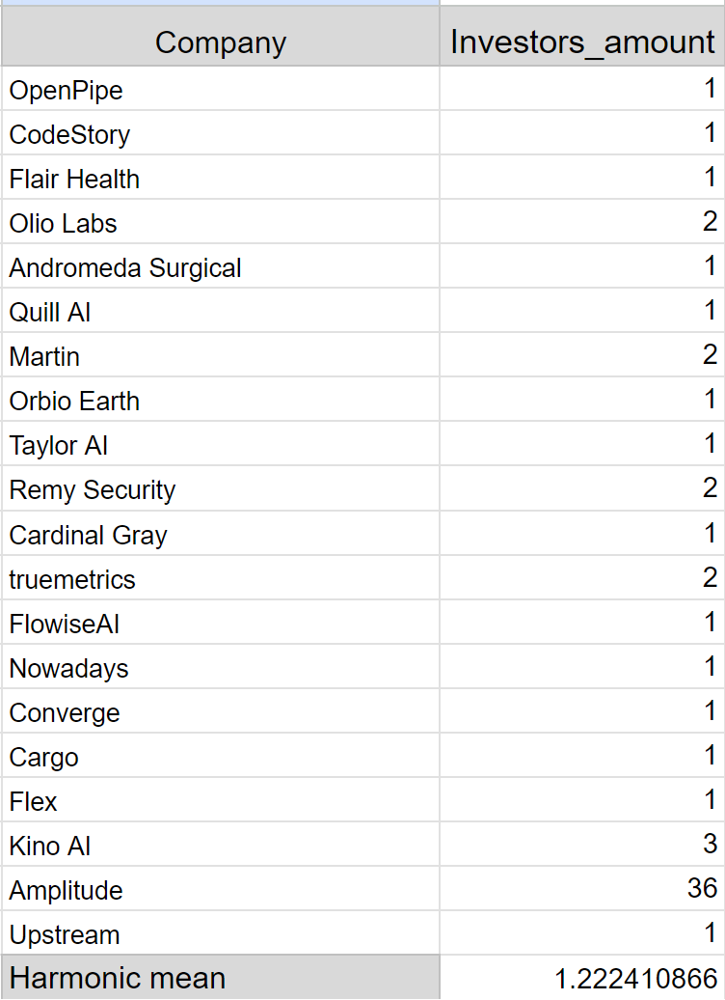
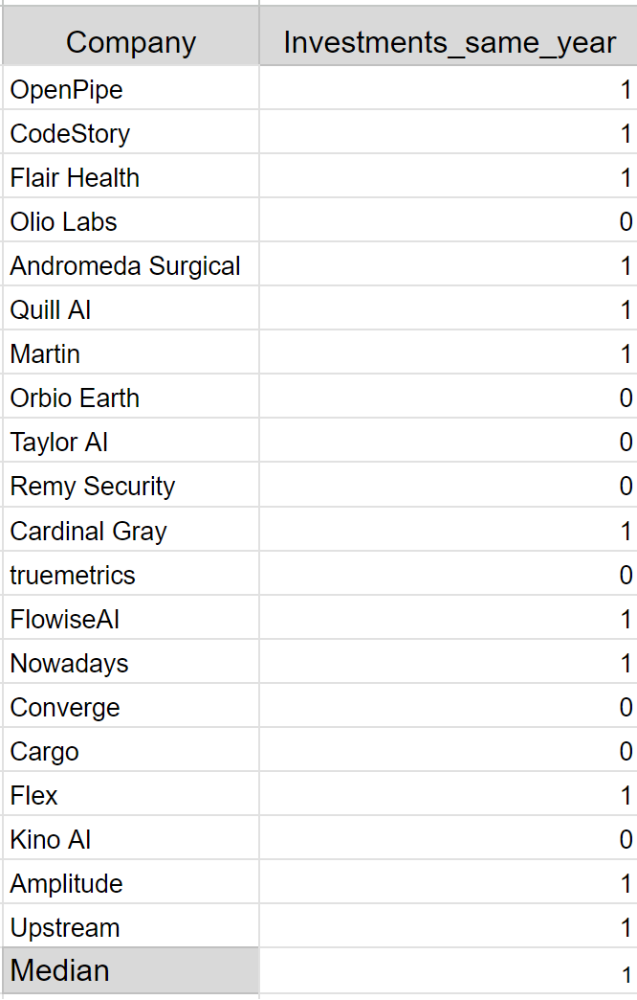
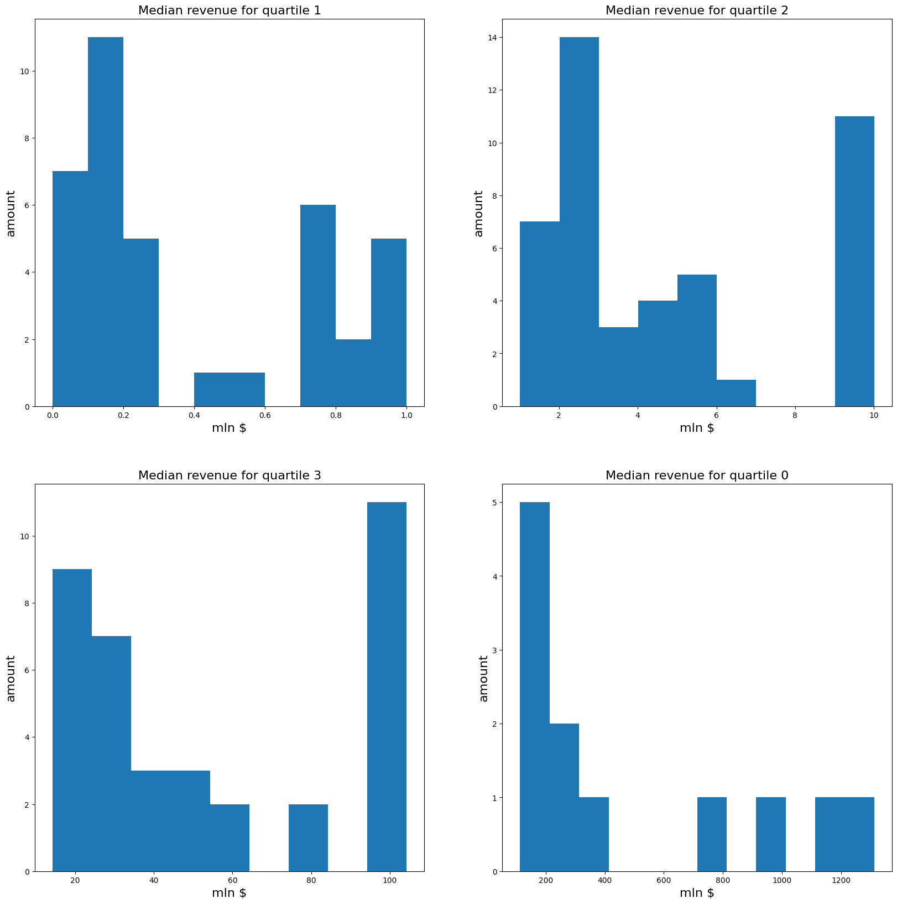
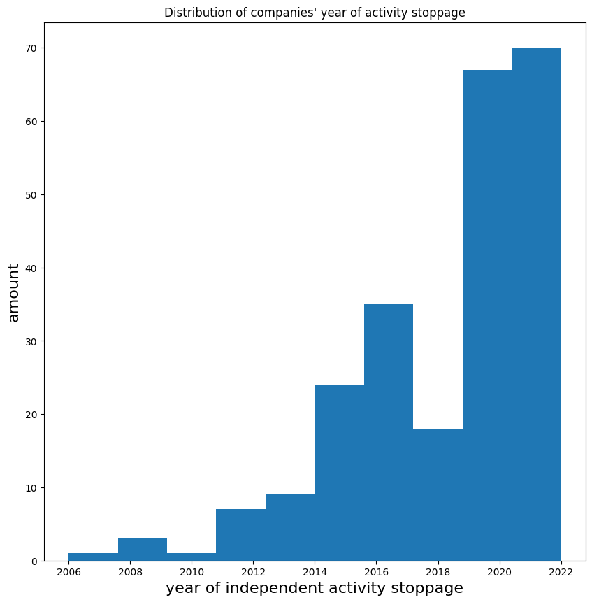
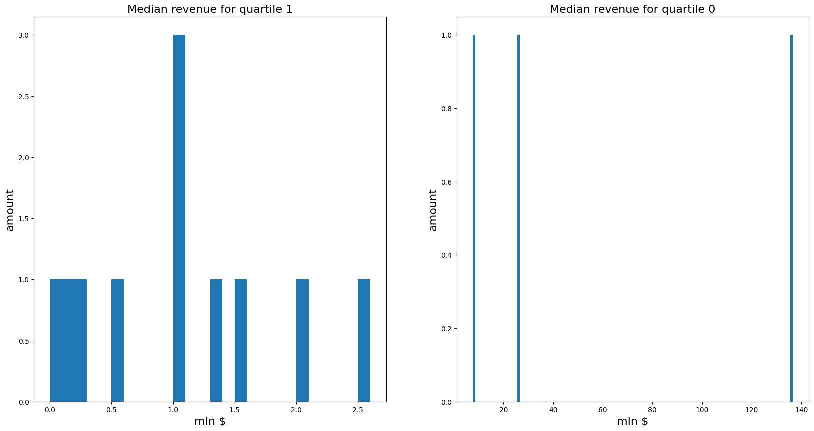

# Investigation: what is needed for project to be successful

## The purpose of the investigation

Find out how many tries it takes to release from <code>Y Combinator</code> and how much income company should gain to stay active if we count it as a success.

## Goals

<ul> 
<li> Gather data about how many times fouders came out from <code>Y Combinator</code>;
<li> Find out, how many projects have investors, if possible;
<li> Is it is possible, try to find out for how many of other startups for each founder no investors were found;
<li> Count averages for gathered data;
<li> Investigate yc_csv.csv to gain information amout incomes.
</ul>

## Gathering

Gathering occurs in Google sheets on page <code>Founders_investigation</code>

## Results

See full details in [URL](https://docs.google.com/spreadsheets/d/1wmtEYf6a_V7i79vYZ5c-faVzt99KR0LTRxeHdqiFIN0/edit#gid=1695031305).

It was collected data for 18 projects from <code>Y Combinator</code> from 2012 til 2023, that were not highly valued. According to results, 12 startups got investments on the year of foundation. Also every founder on average once graduated from YC with 2 as got maximum and all of them have at least one active project.

| Calculation of the harmonic mean of the number of investors for projects | Calculation of the median for the number of projects that received investments in the year of foundation |
|---------------------------------------------------------------------------------|-----------------------------------------------------------------------------------------------------------------------|
|  | |

Thus, we can conclude that to launch a successful but small startup, on average, one attempt is needed to develop projects, at least 1 investor is needed, and on average you can earn $17M.

## Notes

The research results can be viewed in more detail on Google sheets on the sheet <code>Founders_investigation</code>.

## Analysis of a csv-table of large projects from YC

You can view the analysis in detail on the notebook <code>parse_yc_csv.ipynb</code>.

In this table the data on projects released from YC that have a high value was collected. In the notebook the parameters of income and the number of investors for active and inactive companies were examined. We will consider as inactive those that have completed their activities or were sold to another company.

For active we got next histograms:

| Quartiles revenue |
|-------------------|
|  |

These data show that the average income for active companies ranges from $30 million to $100 million. It also should be mentioned that the median indicator gives a value of $5M.

Note that further comparison with inactive companies makes sense: most of them lost their independence or ceased to exist relatively recently - not earlier than 2020. Accordingly, for investigating revenue we will take data on it a year earlier. The following histogram shows this.

| Last year of gaining revenue |
|------------------------------|
|  |

For unactive companies we got other results:

| Notactive revenue |
|-------------------|
|  |

This shows that their income for the most part ranges from a million to one and a half million dollars.

Based on the results of an analysis similar to the previous case, the following results were obtained: for large project to be successful it is needed to have around ten investors to contribute to it. But it is not the critical factor - bot active and unactive companies share this result. The main result is that for company to stay alive it is needed to gain more than $80K a month and better $200K a month.

## Investigation participants

<ul>
<li> <b>Author</b>: Savchuk Anna
<li> <b>Data Collection Assistant</b>: Zavidonova Daniela
</ul>