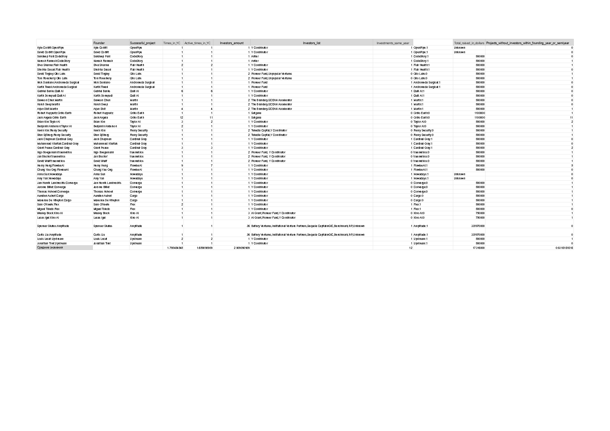

# Цель исследования

Выяснить, сколько попыток необходимо для того, чтобы выпуститься из <code>Y Combinator</code>, если считать это успехом.

## Поставленные цели

<ul> 
<li> Собрать данные, сколько раз фаундеры выпустились из <code>Y Combinator</code>
<li> Выяснить, сколько у проектов инвесторов
<li> Попробовать выяснить, сколько предыдущих проектов фаундеров за полгода не нашли инвесторов
<li> Вычислить средние значения по собранным данным
</ul>

## Сбор данных

Сбор данных происходит в google таблицах на листе <code>AnnaSavchuk</code>

## Результаты

Были собраны некоторые данные по 18ти проектам, невысоко оценённых по деньгам, выпущенным из <code>Y Combinator</code> с 2012 по 2023 год. Из сделанных вычислений было получено, что 12 стартапов получили инвестиции в год основания. Также в среднем каждый основатель выпустился из <code>Y Combinator</code> 1 раз и после выпуска на текущий из них имеет 1 активный проект.

| Вычисления среднего гармонического по чилу инвесторов для проектов | Вычисление медианы для числа проектов, получивших инвестиции в год основания |
|--------------------------------------------------------------------|-----------------------------------------------------------------------------|
|  | |

Таким образом, можно сделать вывод, что для запуска успешного, но небольшого стартапа достаточно в среднем одной попытки разработок проектов, хотя бы 1 инвестор и в среднем можно заработать $17M.

## Замечания

Более подробно результаты исследования можно рассмотреть в pdf-файле <code>YC Data 2023 - AnnaSavchuk</code> в папке <code>assets</code> или в google таблицах на листе <code>AnnaSavchuk</code>.

## Анализ csv-таблицы крупных проектов из YC

Подробно рассмотреть анализ можно в ноутбуке <code>parse_yc_csv.ipynb</code>.

В этой таблице были собраны данные по проектам, выпущенным из YC, имеющие высокую стоимость. По результатам похожего на предыдущий случай анализа, были получены следующие результаты: для "удачности" крупного стартапа в любом случае необходимо около десяти инвесторов, при успехе можно получить выручку размером больше 50 миллионов долларов. При этом были также найдены списки инвесторов, на которые можно ориентироваться при поиске поддержки для проекта.

## Участники исследования

<ul>
<li> <b>Автор</b>: Савчук Анна
<li> <b>Помощник при сборке данных</b>: Завидонова Даниела
</ul>