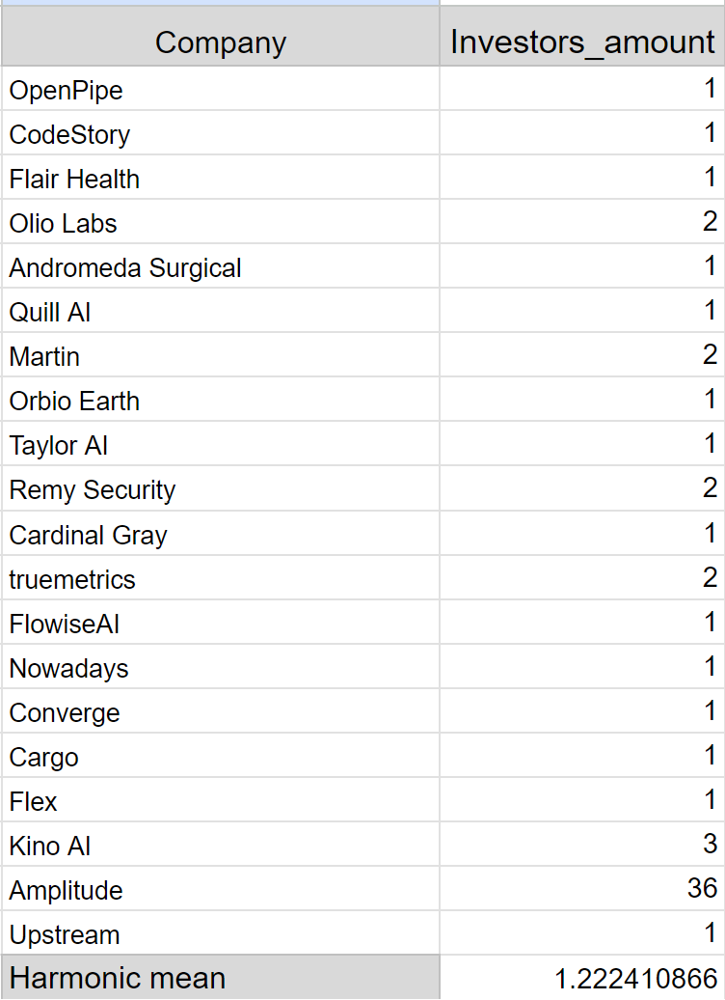
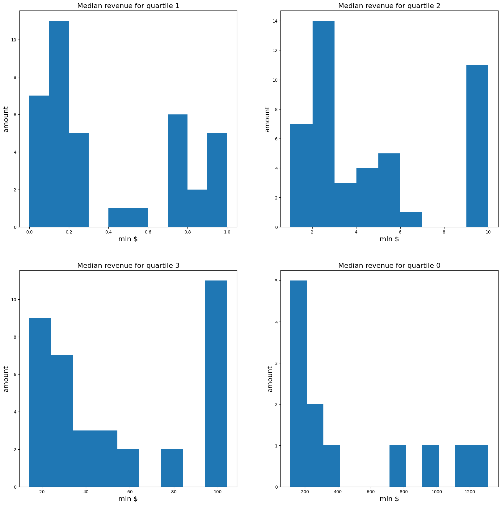

# Цель исследования

Выяснить, сколько попыток необходимо для того, чтобы выпуститься из <code>Y Combinator</code>, если считать это успехом.

## Поставленные цели

<ul> 
<li> Собрать данные, сколько раз фаундеры выпустились из <code>Y Combinator</code>
<li> Выяснить, сколько у проектов инвесторов
<li> Попробовать выяснить, сколько предыдущих проектов фаундеров за полгода не нашли инвесторов
<li> Вычислить средние значения по собранным данным
</ul>

## Сбор данных

Сбор данных происходит в Google таблицах на листе <code>Founders_investigation</code>

## Результаты

Детали можно увидеть по ссылке [на таблицу](https://docs.google.com/spreadsheets/d/1wmtEYf6a_V7i79vYZ5c-faVzt99KR0LTRxeHdqiFIN0/edit#gid=1695031305).

Были собраны некоторые данные по 18ти проектам, невысоко оценённых по деньгам, выпущенным из <code>Y Combinator</code> с 2012 по 2023 год. Из сделанных вычислений было получено, что 12 стартапов получили инвестиции в год основания. Также в среднем каждый основатель выпустился из <code>Y Combinator</code> 1 раз и после выпуска на текущий из них имеет 1 активный проект.

| Вычисления среднего гармонического по чилу инвесторов для проектов | Вычисление медианы для числа проектов, получивших инвестиции в год основания |
|--------------------------------------------------------------------|-----------------------------------------------------------------------------|
|  | |

Таким образом, можно сделать вывод, что для запуска успешного, но небольшого стартапа достаточно в среднем одной попытки разработок проектов, хотя бы 1 инвестор и в среднем можно заработать $17M.

## Замечания

Более подробно результаты исследования можно рассмотреть в Google таблицах на листе <code>Founders_investigation</code>.

## Анализ csv-таблицы крупных проектов из YC

Подробно рассмотреть анализ можно в ноутбуке <code>parse_yc_csv.ipynb</code>.

В этой таблице были собраны данные по проектам, выпущенным из YC, имеющие высокую стоимость. В ноутбуке были рассмотрены параметры дохода и числа инвесторов для активных и неактивных компаний. В качестве неактивных будем считать тех, что завершили свою деятельность или были проданы другой компании.

Для активных получили следующие гистограммы:

| Доход по квартилям |
|--------------------|
|  |

По этим данным видно, что средний доход для активных компаний составляет от 30млн долларов до 100млн долларов. При этом медианный показатель даёт значение в $5M.

Заметим, что дальнейшее сравнение с неактивными компаниями имеет смысл: большая часть из них потеряла свою независимость или перестала существовать сравнительно недавно - не раньше 2020 года. соответственно доходы будем брать за год раньше. Следующая гистограмма это показывает.

| Последний год получения дохода |
|--------------------------------|
|  |

Для неактивных компаний результаты следующие:

| Доход в гистограммах |
|--------------------|
|  |

Отсюда видно, что их доход в большинстве своём составляет от миллиона до полутора миллиона долларов.

Итак, по результатам похожего на предыдущий случай анализа, были получены следующие результаты: для "удачности" крупного стартапа в любом случае необходимо около десяти инвесторов, соответственно этот параметр решающим не является. При успехе можно получить выручку размером больше $5M. При этом, чтобы оставаться активной компанией, ей необходимо получать от $80K в месяц, а для большей вероятности - от $200K в месяц.

## Участники исследования

<ul>
<li> <b>Автор</b>: Савчук Анна
<li> <b>Помощник при сборке данных</b>: Завидонова Даниела
</ul>