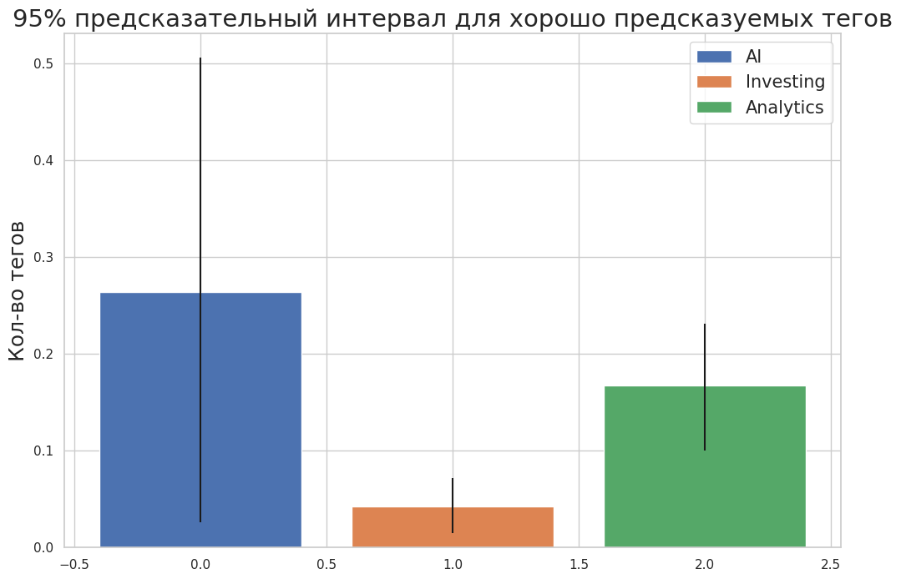

# YCombinator Tags Research Project

## Overview

This project aims to analyze and explore the tags used in the YCombinator database. YCombinator is a popular platform for sharing and discussing technology-related content, and tags are an essential part of categorizing and organizing this content. This research project tries to predict tags for the following batches of YC

## Goal

Create model to predict which tags are to be preferred in the next YC batches.

## Results

Some tags have good estimated prediction accuracy, their prediction results are presented in the last cell

## License

This project is licensed under the MIT License. Feel free to use, modify, and distribute the code for your own research or projects.
