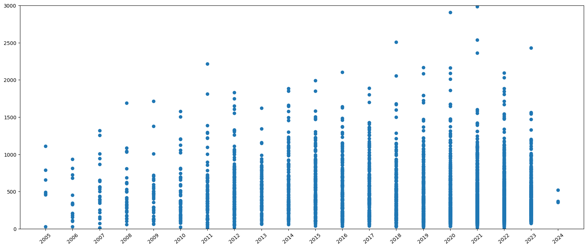
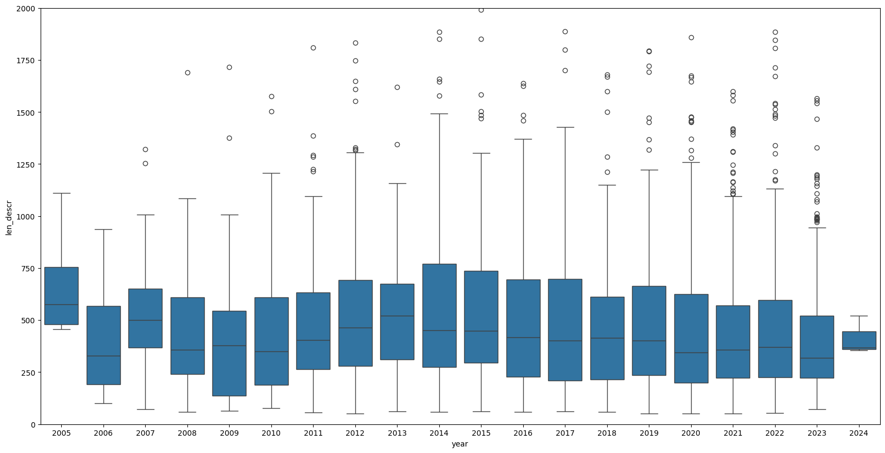
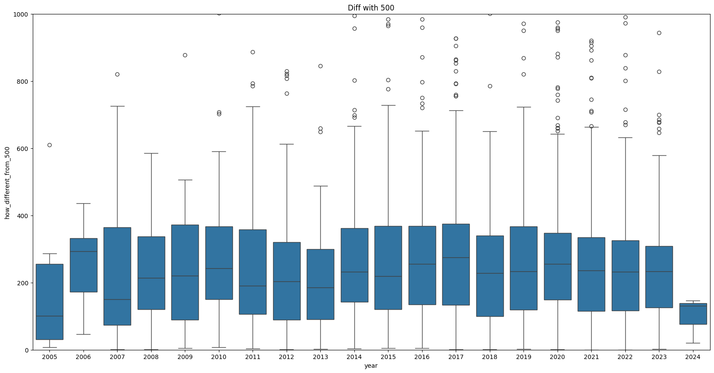
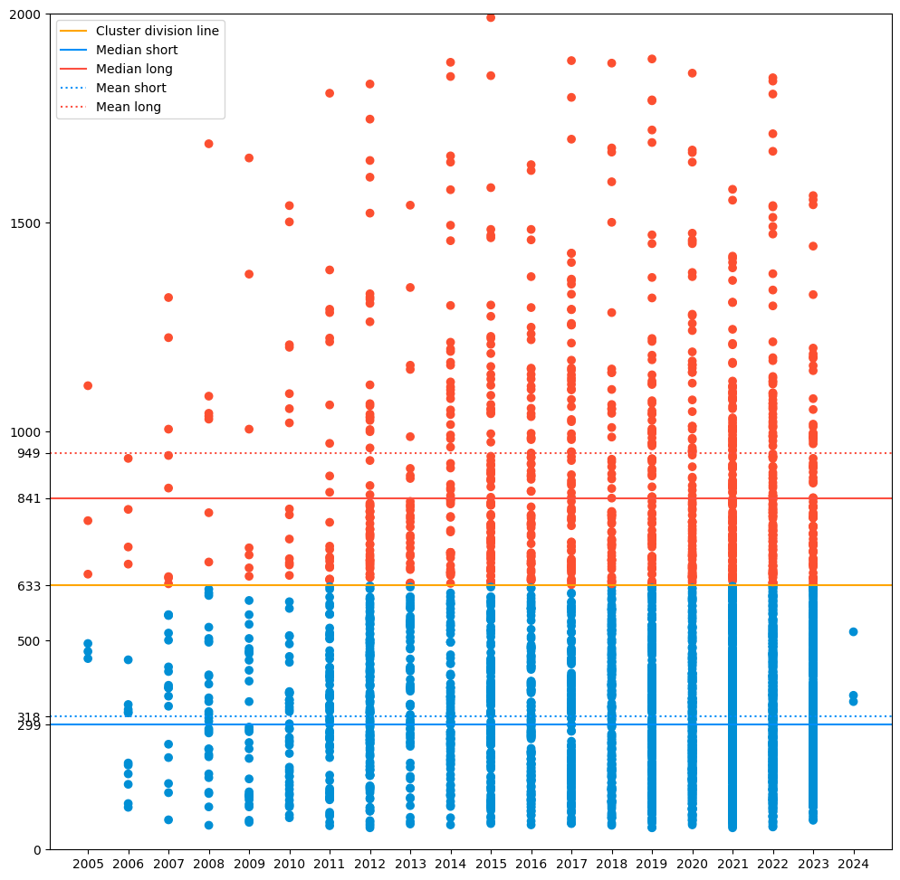
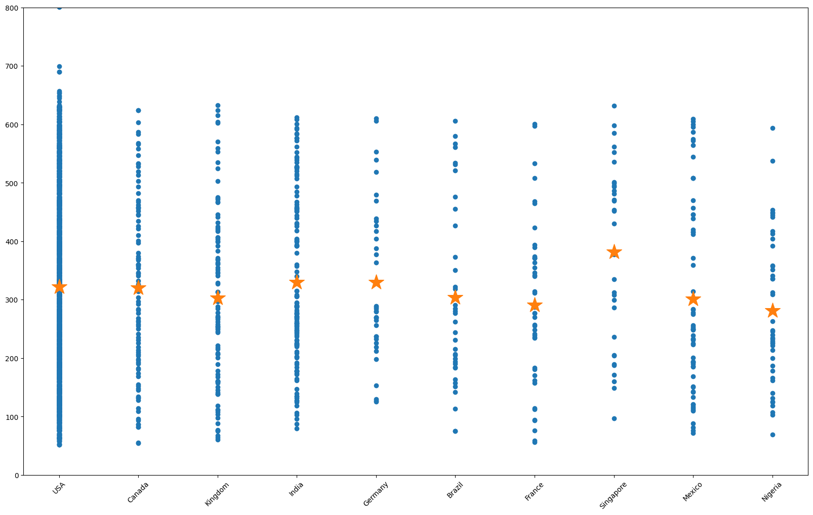
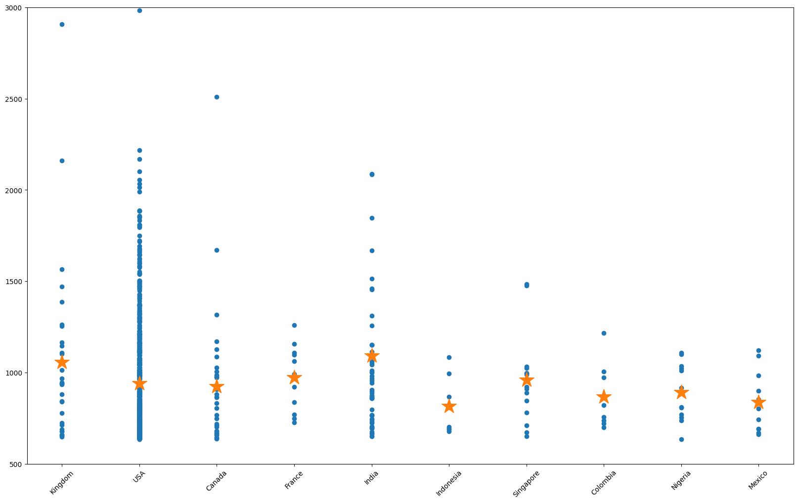

# Descriptions of Startups

Good description of startup is like a little elevator pitch that can help starup to skyrocket, while the bad one...

> Hypothesis 1: It seems like with time coming we started to recieve longer and longer description? Is it true? If yes, what are the possible reasons? 

First try: let's just do the scatter plot  with **year <-> length of description**

Well, we can see that with time coming we *do* have longer descriptions, although still a lot of themm fall in the category **Length around 500 tokens**

Let's try to plot the mean values:

Here we can see that although during the time period 2005-2010  our mean value was more unstable, since 2011 it was fluctuating around 400.

Also, we can notice that mean length is slightly decreasing throught our time period.

So, we can reject our Hypothesis for now.

However, let's additionaly investiagty how lengths were different from 500 (our hypothesesed "ideal" length)

In average, we get 200 tokens difference.

> Hypothesis 2: Maybe if we cluster our data to two clusters w.r.t to the length, we will be able to analyse everything withing clusters?

Here I plot median and mean value for both clusters. 
What we see - for small cluster mean and median are virtually the same and equal to 300 tokens.

For longer ones, due to outliers, mean is pretty distant from median, and median is equal to 841, while mean is 949.

Now let's investigate which countries are the most eloquent and which are the most talkative.

Short descriptions:

Long descriptions:

# Creating New Descriptions

I finetuned GPT-2 on descriptions and started to generate the new ones.

Since decoder is requiring starting prompt, I feed it with the first sentence of description.

Some examples:

The max number of word to generated was set here to 20:

### Prompt 1
:thought_balloon: *Prompt*
> "New startup, LeeMonade, introduce you our new refreshing drink for you"

:robot: *Answer*
> 'New startup, LeeMonade, introduce you our new refreshing drink for you to enjoy with all your friends, coworkers and family. No more fuss, no more wasted money. We give you a hard time with even the simplest of menus and an easy way to get through it.'
_________
### Prompt 2
:thought_balloon: *Prompt*
> "What do you know about Tyergrth? We provide you with the newest way to do the transactions"

:robot: *Answer*
>  "What do you know about Tyergrth? We provide you with the newest way to do the transactions you need to connect your account to your real bank account. In turn, you'll never have to worry about having your account blocked by a firewall or other means. How to use Tiers             
>  1. Sign up for Tiers
>  1. In your Account page, scroll down to Buy and sell and click signup. Choose a Store or come back to the Marketplace.
>  2. Tap on the Unique Products list. In the top-right corner, click the product"
_________
### Prompt 3
Here I set the max number of word in generating to 2000 (so not to limit the model in creation):

:thought_balloon: *Prompt*
> "Latte Art AI was designed for you to create the most beautiful drawings on your frothy latte with the help of AI. The possibilities are insane: you can"

:robot: *Answer*
> 'Latte Art AI was designed for you to create the most beautiful drawings on your frothy latte with the help of AI. The possibilities are insane: you can add colors, enhance textures, add layers, repeat, and edit the drawings. There are many games, and games you can play and play with AI – but there is no such thing as "time travel." At Microsoft, we believe you are going to enjoy programming, like this "Magic Hat" on your computer.
We created this magic hat so you can use it to enjoy and learn on your computer at home and at work, no matter where you live. We understand you want it to become a part of your daily life.
Made from the material that came with your computer, we make every effort to make your ideas and experiences as comfortable as possible. We use our own proprietary AI technology to generate a simplified interface. This enables you to open your computer to a video editor and visual editor on your computer screen.
In addition to making that experience more comfortable for you, we also believe it helps you find your favorite content, discover amazing articles on your favorite news websites, and get started on growing your business.'

_________
### Prompt 4

:thought_balloon: *Prompt*
>  "Woptify provides with all the data concerning your music taste. You can get new statistics, insignts and suggestions that help you find your new favourite tracks. Moreover,"

:robot: *Answer*
> 'Woptify provides with all the data concerning your music taste. You can get new statistics, insignts and suggestions that help you find your new favourite tracks. Moreover, Woptify is free to use so you can use it all with other people.'