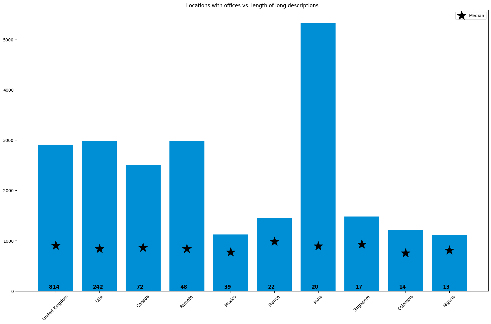
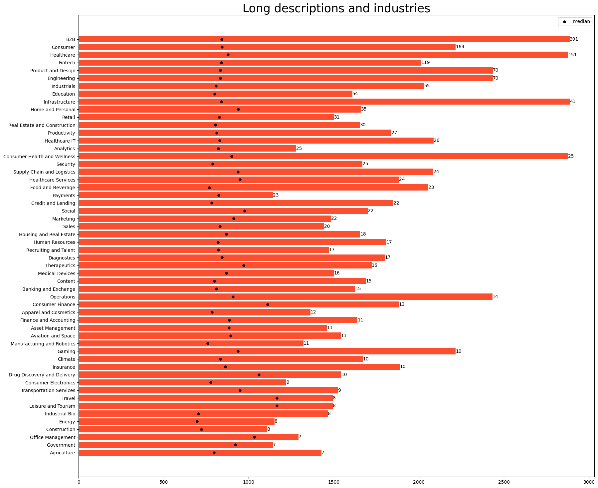
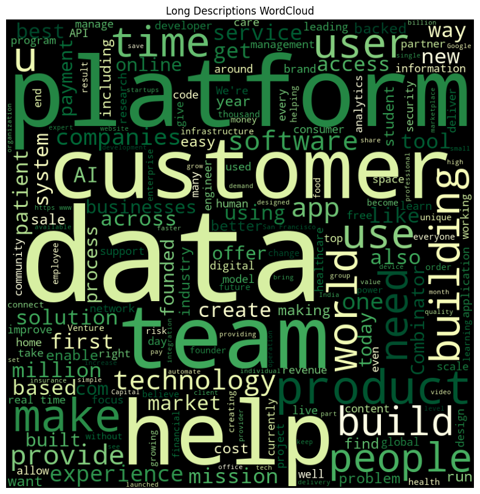

# Descriptions of Startups

## Goals:
investigate insights about startups' descriptions

## Hypotheses
> Hypothesis 1: It seems like with time coming we started to recieve longer and longer description? Is it true? If yes, what are the possible reasons? 

First try: let's just do the scatter plot  with **year <-> length of description**

Well, we can see that with time coming we *do* have longer descriptions, although still a lot of themm fall in the category **Length around 500 tokens**

Let's try to plot the mean values:

Here we can see that although during the time period 2005-2010  our mean value was more unstable, since 2011 it was fluctuating around 400.

Also, we can notice that mean length is slightly decreasing throught our time period.

So, we can reject our Hypothesis for now.

However, let's additionaly investigate how lengths were different from 500 (our hypothesesed "ideal" length)

In average, we get 200 tokens difference.

> Hypothesis 2: Maybe if we cluster our data to two clusters w.r.t to the length, we will be able to analyse everything withing clusters?

Here I plot median and mean value for both clusters. 
What we see - for small cluster mean and median are virtually the same and equal to 300 tokens.

For longer ones, due to outliers, mean is pretty distant from median, and median is equal to 841, while mean is 949.

## Clusters
Now let's investigate which countries are the most eloquent and which are the most talkative.

Pie chart:
_____________________________

# Countries and Descriptions

short_countries_descriptions.png

Short descriptions:

Long descriptions:

_____________________________
# Industries and Descriptions

Long: the least talktaive wrt to median: Energy and Industrial Bio, the most talktaive wrt to median within 600 symbols are Travel, Leisure nad Tourism.

Let's see:
| Industry           | Counter |
|--------------------|---------|
|              B2B   |     391 |
|           Consumer |     164 |
|         Healthcare |     151 |
|            Fintech |     119 |
|        Engineering |      70 |
| Product and Design |      70 |
|        Industrials |      55 |

Short: the least talktaive: Content, Banking and Exchange, the most talktaive within 600 symbols are Agriculture and Office Management. However, the latter two has noticeable spike of median value considered with the remaining industires. The majority of industries have their median values around 300 symbols.

Let's see the top-7 numerous industries just like we did for long descriptions:

| Industry           | Counter |
|--------------------|---------|
|                B2B |    1463 |
|           Consumer |     508 |
|            Fintech |     374 |
|         Healthcare |     320 |
|        Engineering |     302 |
| Product and Design |     302 |
|        Industrials |     15  |

_____________________________
# Creating WordClouuds

Platform, customer, data, help, team - common words for both
Also the popular ones are product, AI.

Verbs: build, use, make